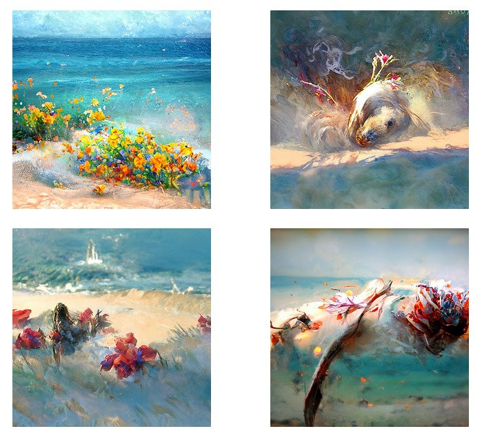
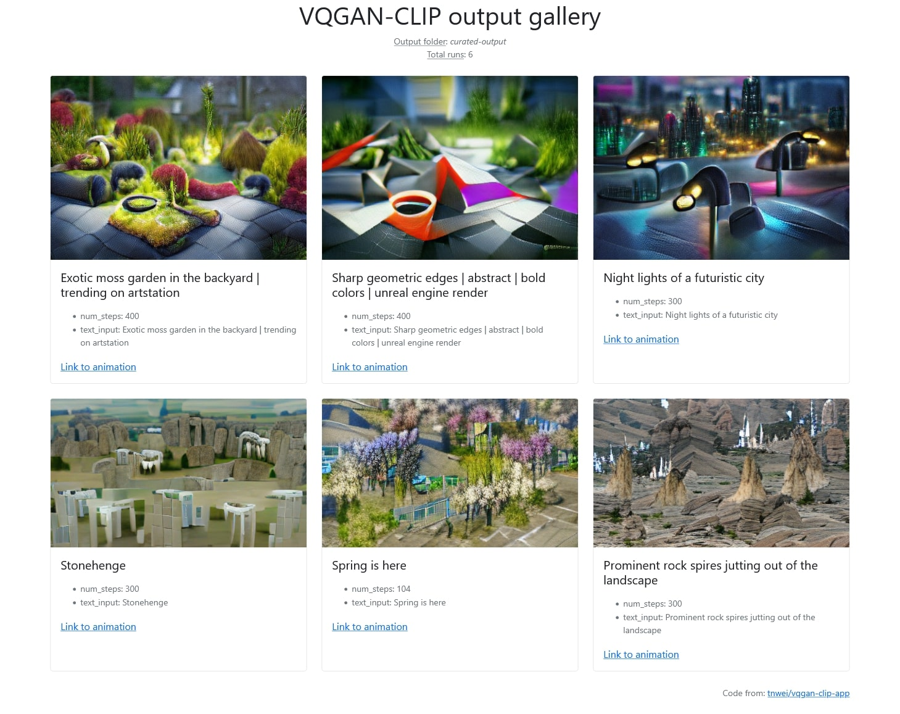

# VQGAN-CLIP web app & CLIP guided diffusion web app


Link to repo: [tnwei/vqgan-clip-app](https://github.com/tnwei/vqgan-clip-app). 

## Intro to VQGAN-CLIP

VQGAN-CLIP has been in vogue for generating art using deep learning. Searching the `r/deepdream` subreddit for VQGAN-CLIP yields [quite a number of results](https://www.reddit.com/r/deepdream/search?q=vqgan+clip&restrict_sr=on). Basically, [VQGAN](https://github.com/CompVis/taming-transformers) can generate pretty high fidelity images, while [CLIP](https://github.com/openai/CLIP) can produce relevant captions for images. Combined, VQGAN-CLIP can take prompts from human input, and iterate to generate images that fit the prompts.

Thanks to the generosity of creators sharing notebooks on Google Colab, the VQGAN-CLIP technique has seen widespread circulation. However, for regular usage across multiple sessions, I prefer a local setup that can be started up rapidly. Thus, this simple Streamlit app for generating VQGAN-CLIP images on a local environment. Screenshot of the UI as below:


Be advised that you need a beefy GPU with lots of VRAM to generate images large enough to be interesting. (Hello Quadro owners!). For reference, an RTX2060 can barely manage a 300x300 image. Otherwise you are best served using the notebooks on Colab.

Reference is [this Colab notebook](https://colab.research.google.com/drive/1L8oL-vLJXVcRzCFbPwOoMkPKJ8-aYdPN?usp=sharing) originally by Katherine Crowson. The notebook can also be found in [this repo hosted by EleutherAI](https://github.com/EleutherAI/vqgan-clip).

## Intro to CLIP guided diffusion

In mid 2021, Open AI released [Diffusion Models Beat GANS on Image Synthesis](arxiv.org/abs/2105.05233), with corresponding [source code and model checkpoints released on github](https://github.com/openai/guided-diffusion). The cadre of people that brought us VQGAN-CLIP worked their magic, and shared CLIP guided diffusion notebooks for public use. CLIP guided diffusion uses more GPU VRAM, runs slower, and has fixed output sizes depending on the trained model checkpoints, but is capable of producing more breathtaking images.

Here's a few examples using the prompt _"Flowery fragrance intertwined with the freshness of the ocean breeze by Greg Rutkowski"_, run on the 512x512 HQ Uncond model:



The implementation of CLIP guided diffusion in this repo is based on notebooks from the same `EleutherAI/vqgan-clip` repo. 

## Setup

1. Install the required Python libraries. Using `conda`, run `conda env create -f environment.yml`
2. Git clone this repo. After that, `cd` into the repo and run:
    + `git clone https://github.com/CompVis/taming-transformers` (Update to pip install if either of [these](https://github.com/CompVis/taming-transformers/pull/89) [two](https://github.com/CompVis/taming-transformers/pull/81) PRs are merged)
    + `git clone https://github.com/crowsonkb/guided-diffusion` (Update to pip install if [this PR](https://github.com/crowsonkb/guided-diffusion/pull/2) is merged)
3. Download the pretrained weights and config files using the provided links in the files listed below. Note that that all of the links are commented out by default. Recommend to download one by one, as some of the downloads can take a while. 
    + For VQGAN-CLIP: `download-weights.sh`. You'll want to at least have both the ImageNet weights, which are used in the reference notebook.
    + For CLIP guided diffusion: `download-diffusion-weights.sh`. 

## Usage

+ VQGAN-CLIP: `streamlit run app.py`, launches web app on `localhost:8501` if available
+ CLIP guided diffusion: `streamlit run diffusion_app.py`, launches web app on `localhost:8501` if available
+ Image gallery: `python gallery.py`, launches a gallery viewer on `localhost:5000`. More on this below.

In the web app, select settings on the sidebar, key in the text prompt, and click run to generate images using VQGAN-CLIP. When done, the web app will display the output image as well as a video compilation showing progression of image generation. You can save them directly through the browser's right-click menu. 

A one-time download of additional pre-trained weights will occur before generating the first image. Might take a few minutes depending on your internet connection.

If you have multiple GPUs, specify the GPU you want to use by adding `-- --gpu X`. An extra double dash is required to [bypass Streamlit argument parsing](https://github.com/streamlit/streamlit/issues/337). Example commands:

```bash
# Use 2nd GPU
streamlit run app.py -- --gpu 1

# Use 3rd GPU
streamlit run diffusion_app.py -- --gpu 2
```

See: [tips and tricks](docs/tips-n-tricks.md)

## Output and gallery viewer

Each run's metadata and output is saved to the `output/` directory, organized into subfolders named using the timestamp when a run is launched, as well as a unique run ID. Example `output` dir:

``` bash
$ tree output
├── 20210920T232927-vTf6Aot6
│   ├── anim.mp4
│   ├── details.json
│   └── output.PNG
└── 20210920T232935-9TJ9YusD
    ├── anim.mp4
    ├── details.json
    └── output.PNG
```

The gallery viewer reads from `output/` and visualizes previous runs together with saved metadata. 



If the details are too much, call `python gallery.py --kiosk` instead to only show the images and their prompts.

## More details

+ [Architecture](docs/architecture.md)
+ [Implementation details](docs/implementation-details.md)
+ [Tips and tricks](docs/tips-n-tricks.md)
+ [Notes and observations](docs/notes-and-observations.md)