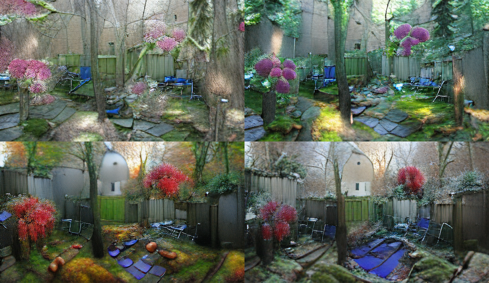

# VQGAN-CLIP web app

## Brief intro

VQGAN-CLIP has been in vogue for generating art using deep learning. Searching the `r/deepdream` subreddit for VQGAN-CLIP yields [quite a number of results](https://www.reddit.com/r/deepdream/search?q=vqgan+clip&restrict_sr=on). Basically, [VQGAN](https://github.com/CompVis/taming-transformers) can generate pretty high fidelity images, while [CLIP](https://github.com/openai/CLIP) can produce relevant captions for images. Combined, VQGAN-CLIP can take prompts from human input, and iterate to generate images that fit the prompts.

Thanks to the generosity of creators sharing notebooks on Google Colab, the VQGAN-CLIP technique has seen widespread circulation. However, for regular usage across multiple sessions, I prefer a local setup that can be started up rapidly. Thus, this simple Streamlit app for generating VQGAN-CLIP images on a local environment. Screenshot of the UI as below:

Be advised that you need a beefy GPU with lots of VRAM to generate images large enough to be interesting. (Hello Quadro owners!). For reference, an RTX2060 can barely manage a 300x300 image. Otherwise you are best served using the notebooks on Colab.

Reference is [this Colab notebook](https://colab.research.google.com/drive/1L8oL-vLJXVcRzCFbPwOoMkPKJ8-aYdPN?usp=sharing) originally by Katherine Crowson. The notebook can also be found in [this repo hosted by EleutherAI](https://github.com/EleutherAI/vqgan-clip).

## Setup

The steps for setup are based on the Colab referenced above. Atm the procedure is a bit messy, there's probably room for improvement here. 

1. Git clone this repo. After that, `cd` into the repo and run: `git clone https://github.com/openai/CLIP` and `git clone https://github.com/CompVis/taming-transformers`.
2. Install `exempi` from your system's package manager. On Debian-based systems, should be `sudo apt install exempi`. 
3. Install the required Python libraries. Using `conda`, run `conda env create -f environment.yml`
4. Download the pretrained weights and config files using links in the `download-weights.sh` script. Note that that all of the links are commented out by default. Recommend to download one by one, as some of the downloads can take a while. You'll want to at least have both the ImageNet weights, which are used in the reference notebook.

## Usage

`streamlit run app.py` launches the web app on `localhost:8501`. In the web app, select settings on the sidebar, key in the text prompt, and click run to generate images using VQGAN-CLIP. When done, the web app will display the output image as well as a video compilation showing progression of image generation. You can save them directly through the browser's right-click menu. 

In addition, each run's info and output is saved to the `output/` directory, organized into subfolders named using the timestamp when a run is launched. 

A one-time download of additional pre-trained weights will occur before generating the first image. Might take a few minutes depending on your internet connection.

## App structure

There is a lot of room for experimentation on this technique. App-related logic is in `app.py`, while most of the underlying logic is stowed away in `utils.py`. Refer to [Streamlit docs](https://docs.streamlit.io/en/stable/index.html) for further info about the web app itself. 

To use your own weights for VQGAN, save both the `yaml` config and the `ckpt` weights in `assets/`, and ensure that they have the same filename, just with different postfixes. It will then appear in the app interface for use. Refer to the [VQGAN repo](https://github.com/CompVis/taming-transformers) for training VQGAN on your own dataset.

Defaults settings for the app upon launch are specified in `defaults.yaml`, which can be further adjusted as necessary.

## Modifications introduced

Added the option to carry over the existing generated image and network weights for use in the next run. If a new image size is specified, the image will be cropped to size accordingly. This allows you to **continue iterating on an image** if you like how it has turned out thus far. Note that chaining a few consecutive short runs of the same prompt and running a single run using the same prompt with equivalent steps does not yield the same outcome. 

Extending upon that feature enables **multi-stage iteration**, where the same image can be iterated upon using different prompts at different stages. For example, you can tell the network to generate "Cowboy singing in the sky", then continue the same image and weights using a different prompt, "Fish on an alien planet under the night sky". Because of how backprop works, the network will find the easiest way to change the previous image to fit the new prompt. Should be useful for preserving visual structure between images, and for smoothly transitioning from one scene to another.

Here is an example where "Backyard in spring" is first generated, then iterated upon with prompts "Backyard in summer", "Backyard in autumn", and "Backyard in winter". Major visual elements in the initial image were inherited and utilized across multiple runs.

In addition, **uploading image prompts has been simplified** compared to using the Colab interface, thanks to Streamlit's file upload widget. From what I've seen thus far, image prompts have a wildcard effect on the content and style of the generated image. Probably reason why I've never seen works of VQGAN-CLIP mentioning use of the image prompt. Either way, if you like clicking "I'm Feeling Lucky" on Google, this is for you.

## Notes

**Generated image size** is bound by GPU VRAM available. The reference notebook default to use 480x480. One of the notebooks in the thoughts section below uses 640x512. For reference, an RTX2060 can barely manage 300x300. You can use image upscaling tools such as [Waifu2X](https://github.com/nagadomi/waifu2x) to further upscale the generated image beyond VRAM limits, but be aware that smaller images fundamentally contain less complexity than larger images. 

Following are GPU VRAM consumption read from`nvidia-smi` as reference, note that your mileage may vary :

| Resolution| VRAM Consumption |
| ----------| ---------------- |
| 300 x 300 | 4,829 MiB        |
| 480 x 480 | 8,465 MiB        |
| 640 x 480 | 10,247 MiB       |
| 800 x 600 | 18,157 MiB       |
| 960 x 720 | 19,777 MiB       |
| 1024 x 768| 22,167 MiB       |
| 1280 x 720| 24,353 MiB       |

**CUDA out of memory error** If you're getting a CUDA out of memory error on your first run, it is a sign that the image size is too large. If you were able to generate images of a particular size prior, then you might have a CUDA memory leak and need to restart the application. Still figuring out where the leak is from.

**VQGAN weights and art style** In the download links are trained on different datasets. You might find them suitable for generating different art styles. The `sflickr` dataset is skewed towards generating landscape images while the `faceshq` dataset is skewed towards generating faces. If you have no art style preference, the ImageNet weights do remarkably well. In fact, VQGAN-CLIP can be conditioned to generate specific styles, thanks to the breadth of understanding supplied by the CLIP model (see tips section).

Some weights have multiple versions, e.g. ImageNet 1024 and Image 16384. The number represents the codebook (latent space) dimensionality. For more info, refer to the [VQGAN repo](https://github.com/CompVis/taming-transformers), also linked in the intro above.

**How many steps to run VQGAN-CLIP?** There is no ground rule on how many steps to run to get a good image. Images generated are also not guaranteed to be interesting. Experiment! 

## Further tips / cool variations from the internet

+ Long, descriptive prompts can have surprisingly pleasant effects: [Reddit post](https://www.reddit.com/r/MediaSynthesis/comments/oej9qc/gptneo_vqganclip/)
+ [Unreal engine trick](https://twitter.com/arankomatsuzaki/status/1399471244760649729?s=20)
+ [Appending "by James Gurney" for stylization](https://moultano.wordpress.com/2021/07/20/tour-of-the-sacred-library/)
+ [Rotation and zoom effect with VQGAN+CLIP and RIFE](https://www.reddit.com/r/MediaSynthesis/comments/oos5xu/rotate_and_zoom_effect_with_vqganclip_and_rife/)

## Thoughts on further work

+ Maybe some kind of operation that disperses pixel intensities can help "reverse" images so that undesired features can be removed? 
+ Regularization using path perception loss?
+ Dockerfile?
+ This [variation](https://colab.research.google.com/drive/1gFn9u3oPOgsNzJWEFmdK-N9h_y65b8fj) of the Colab notebook implements some form of regularization
+ This [variation](https://colab.research.google.com/drive/1go6YwMFe5MX6XM9tv-cnQiSTU50N9EeT?usp=sharing#scrollTo=EXMSuW2EQWsd) of the Colab notebook lists more options for VQGAN pre-trained weights
+ Link up w/ a database so that it's easier to save outputs?
+ Add self-generated image captions from CLIP?
+ Guided diffusion variant: https://colab.research.google.com/drive/1F2M1T2ZQtanFpjBUyId1VaxmqPb4eY5N
